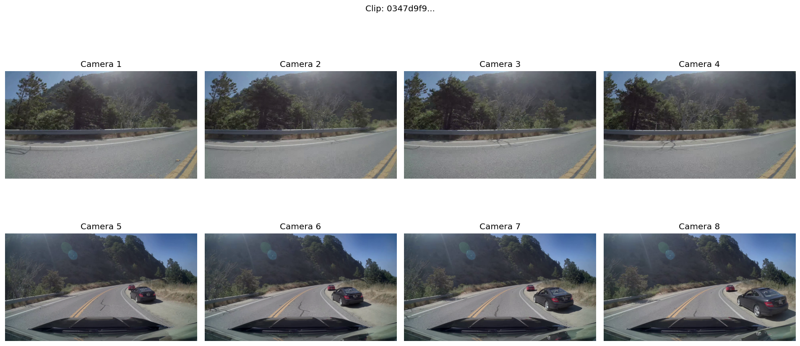
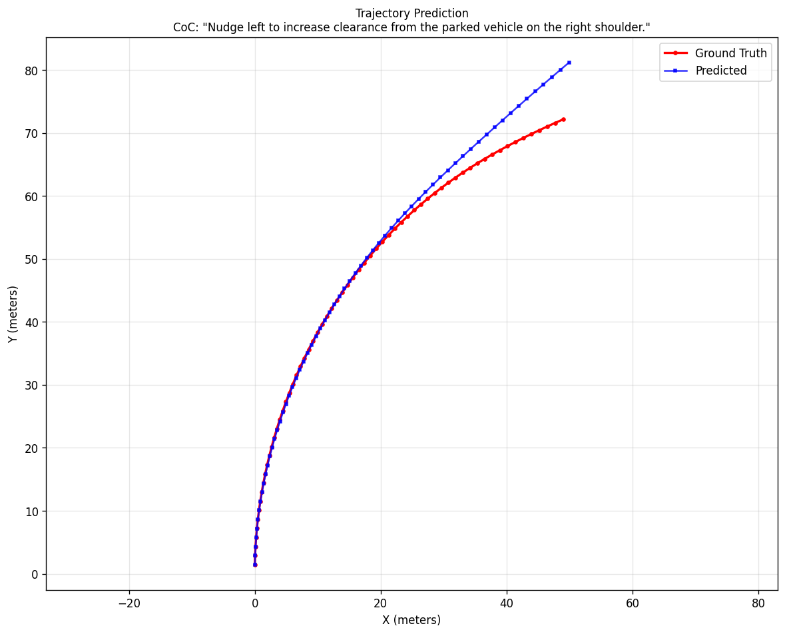
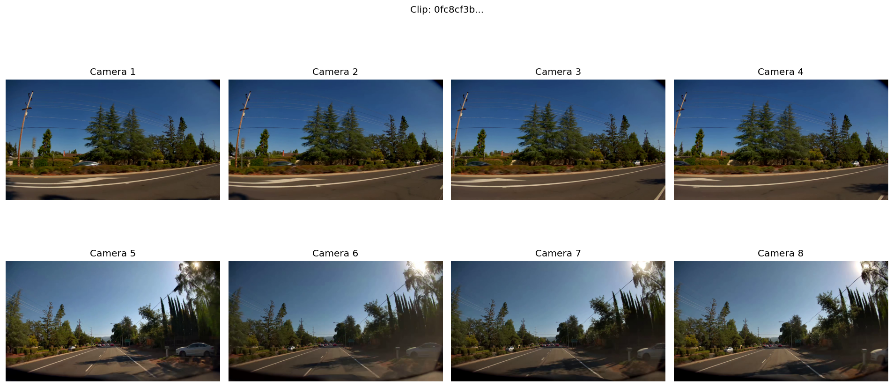
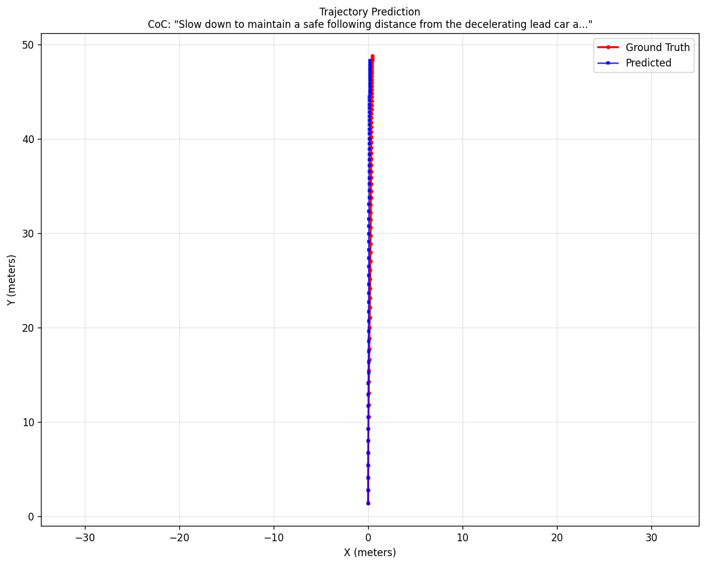
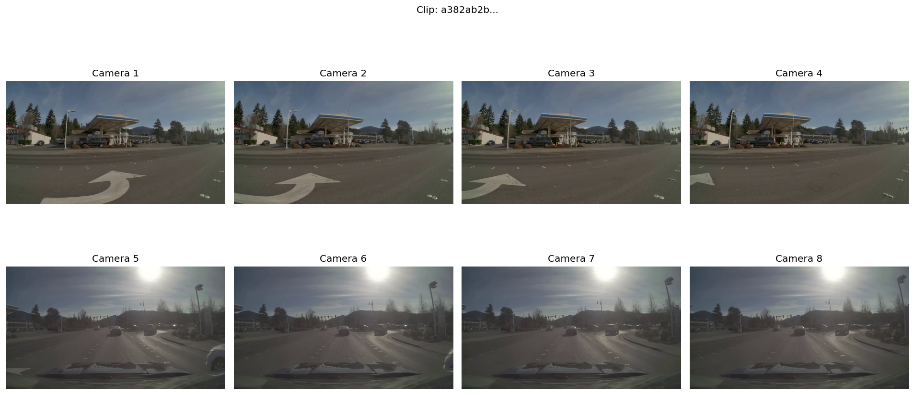
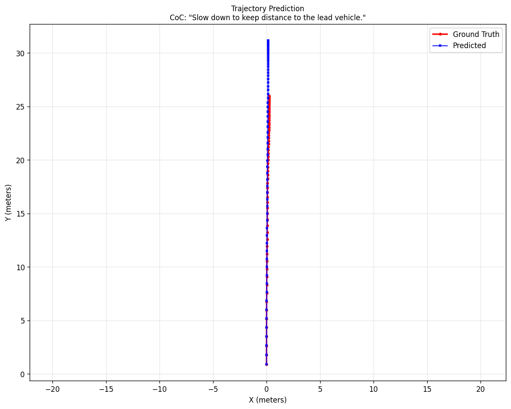
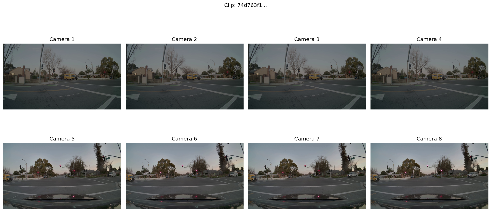
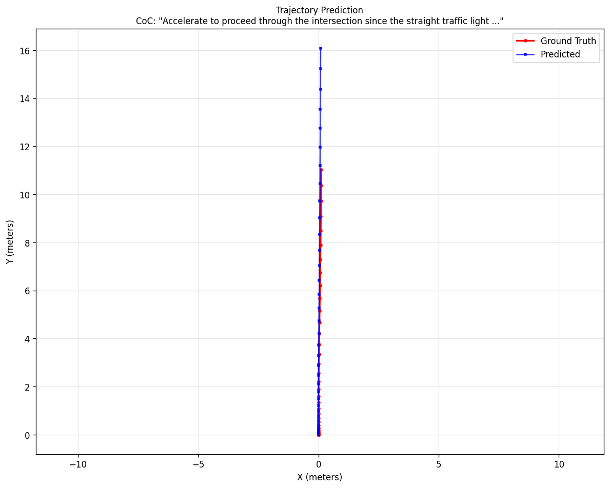
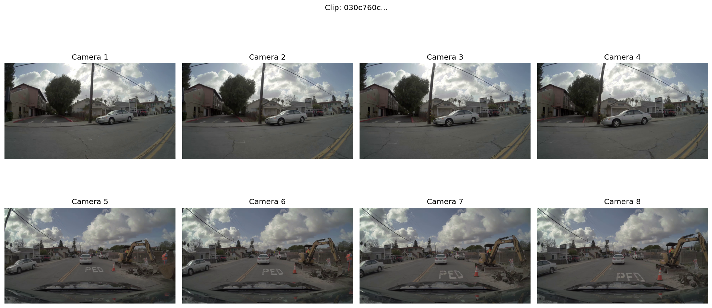
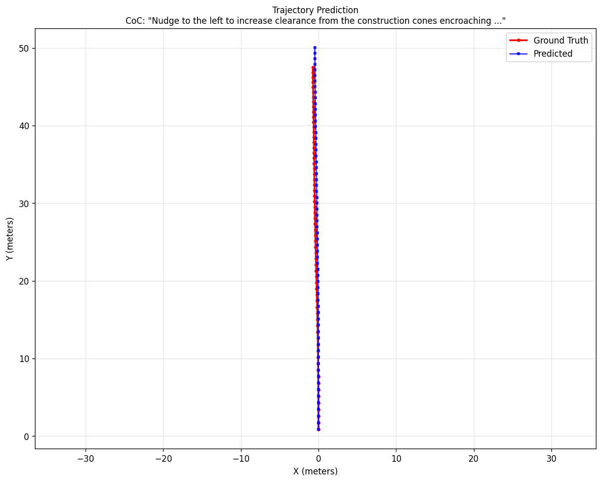

# Inference Examples

PhysicalAI-Autonomous-Vehicles 데이터셋에서 다양한 시나리오의 추론 결과입니다.

## Summary

| Dataset | Value |
|---------|-------|
| Total Clips | 1,181 |
| Tested | 5 |
| Average ADE | 1.34m |

---

## Example 1: Parked Vehicle Avoidance

**Scenario**: 우측 갓길에 주차된 차량 회피

**Chain-of-Causation**:
> "Nudge left to increase clearance from the parked vehicle on the right shoulder."

| Metric | Value |
|--------|-------|
| ADE | 1.66m |
| Max Error | 9.05m |

### Input


### Trajectory


---

## Example 2: Following Decelerating Vehicle

**Scenario**: 앞차 감속 대응

**Chain-of-Causation**:
> "Slow down to maintain a safe following distance from the decelerating lead car ahead."

| Metric | Value |
|--------|-------|
| ADE | 0.56m |
| Max Error | 0.82m |

### Input


### Trajectory


---

## Example 3: Lead Vehicle Following

**Scenario**: 선행 차량 추종

**Chain-of-Causation**:
> "Slow down to keep distance to the lead vehicle."

| Metric | Value |
|--------|-------|
| ADE | 2.56m |
| Max Error | 5.20m |

### Input


### Trajectory


---

## Example 4: Green Light Intersection

**Scenario**: 녹색 신호 교차로 직진

**Chain-of-Causation**:
> "Accelerate to proceed through the intersection since the straight traffic light turns green."

| Metric | Value |
|--------|-------|
| ADE | 1.19m |
| Max Error | 5.05m |

### Input


### Trajectory


---

## Example 5: Construction Zone

**Scenario**: 공사 구간 콘 회피

**Chain-of-Causation**:
> "Nudge to the left to increase clearance from the construction cones encroaching into the lane."

| Metric | Value |
|--------|-------|
| ADE | 0.75m |
| Max Error | 2.56m |

### Input


### Trajectory


---

## Performance Analysis

### ADE Distribution

| Performance | ADE Range | Count |
|-------------|-----------|-------|
| Excellent | < 0.5m | 0 |
| Good | 0.5 - 1.0m | 2 |
| Acceptable | 1.0 - 2.0m | 2 |
| Poor | > 2.0m | 1 |

### CoC Pattern Analysis

| Pattern | Description | Count |
|---------|-------------|-------|
| Nudge | 측면 회피 동작 | 2 |
| Slow down | 감속 동작 | 2 |
| Accelerate | 가속 동작 | 1 |

## Observations

1. **감속 시나리오**에서 가장 낮은 오차 (ADE 0.56m)
   - 직진 주행이 예측하기 쉬움

2. **차선 변경/회피** 시나리오에서 오차 증가
   - 측면 이동 예측의 불확실성

3. **CoC 추론** 품질
   - 상황을 정확하게 파악
   - 명확하고 간결한 설명 생성

## How to Run More Examples

```bash
cd /mnt/data/lfm_agi/alpamayo_code
source ar1_venv/bin/activate

# Edit CLIP_INDICES in batch_inference.py
# Then run:
python batch_inference.py
```
